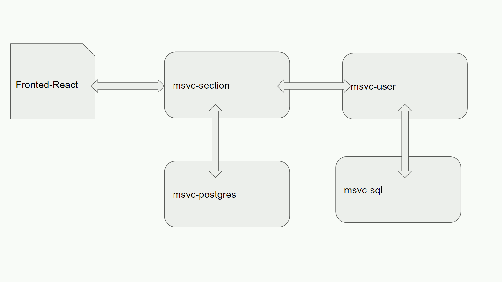
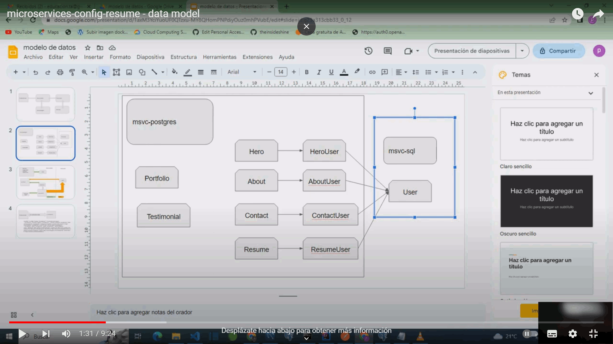
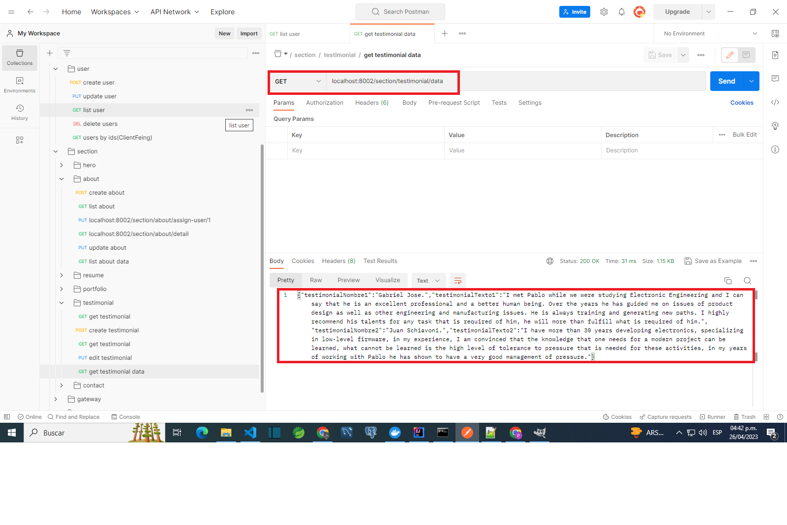
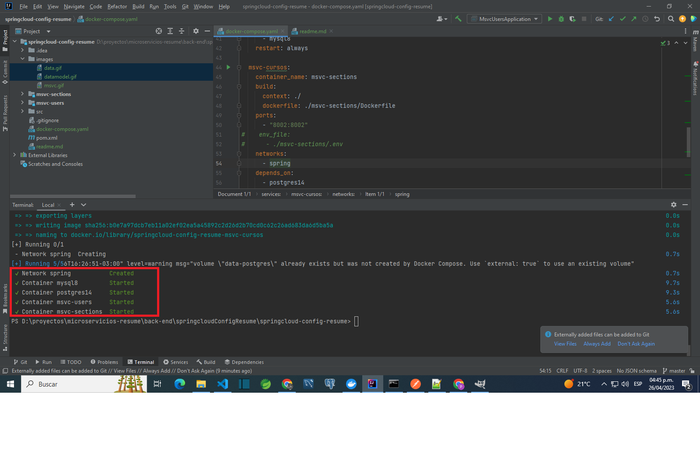
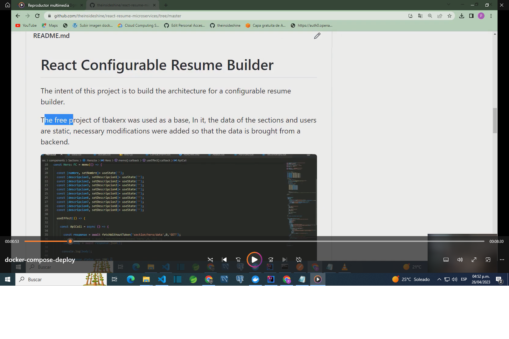
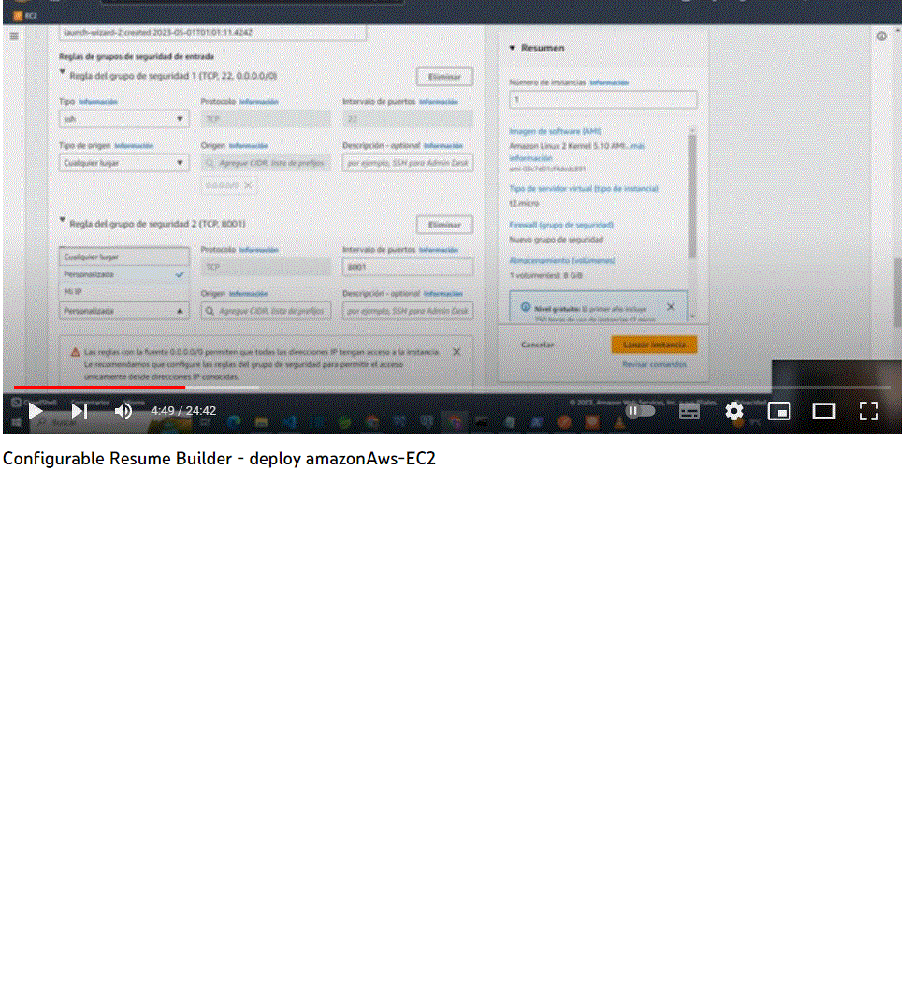
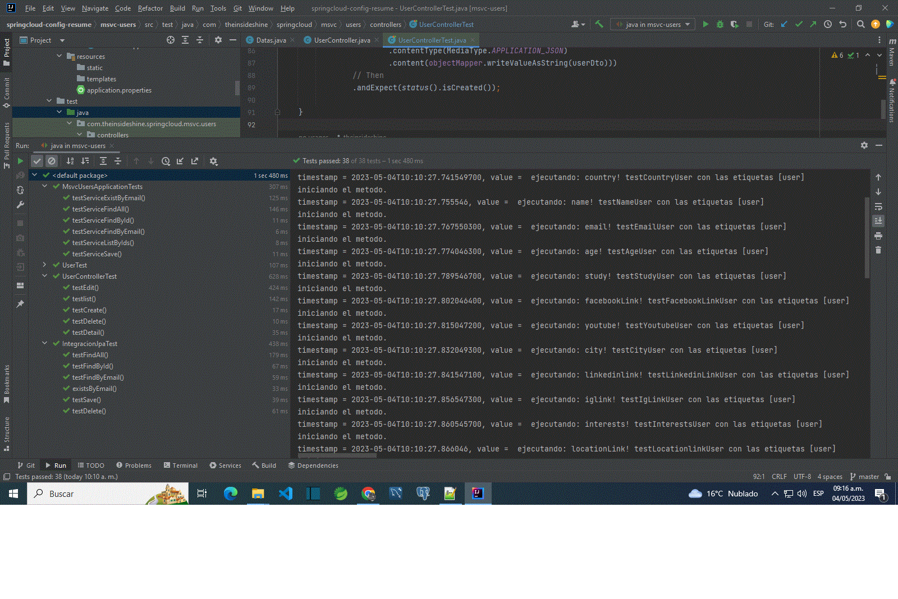
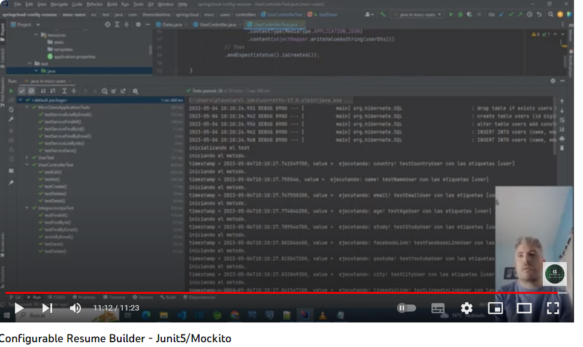

# Microservice Configurable Resume Builder

The intent of this project is to build the architecture for a configurable resume builder.

The ecosystem has 4 microservices

The data model supports multisections and multiusers

Data model

The ecosystem returns the data required by each section

Deployment is done with docker-compose

Guide deploy Aws-EC2: [Deploy aws-EC2](doc/crb-deploy-awsEC2.pdf)

Unit tests were done with Junit5 and Mockito

Frontend repository:
https://github.com/theinsideshine/react-resume-microservices/tree/master

